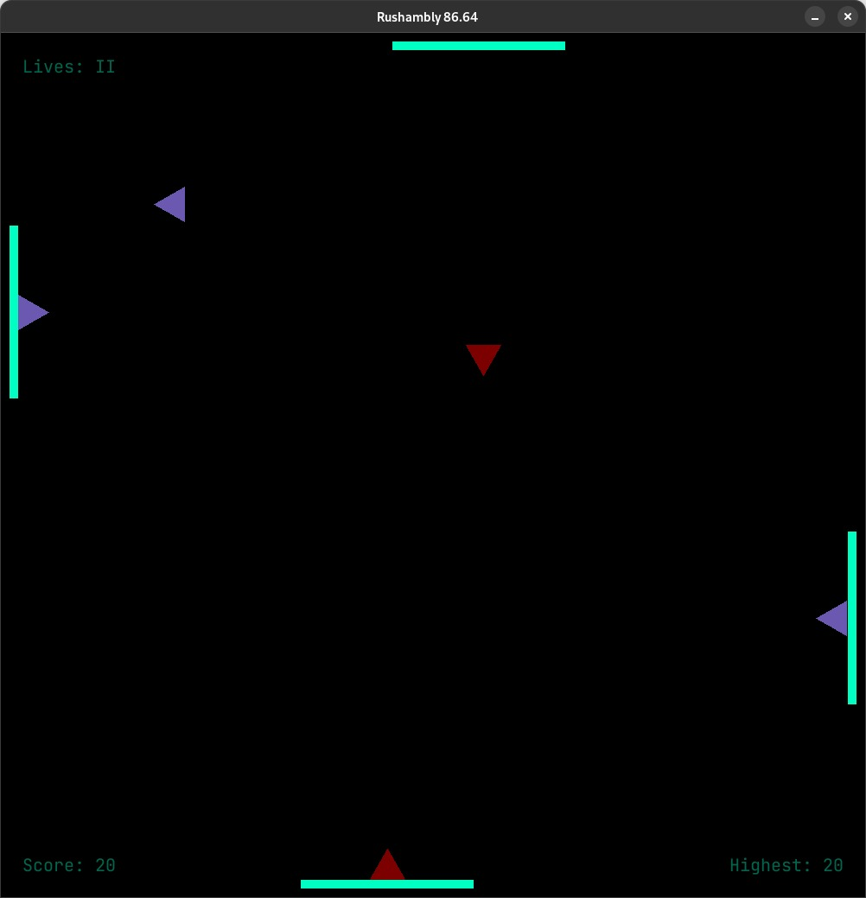

# Rushambly x86-64

Rushambly is a 2D arcade-style game written in x86 Assembly. A mix between pong and space invaders, Rashembly will have you lose track of your mouse in a matter of seconds!

<p width="center">
  
</p>

## How to play?

Play with four rackets that move in relation to your mouse in opposing directions. Your rackets shoot out enemies, and your goal is to try to catch all the points! However, catching a red enemy (spawned when in the center of the screen) or missing a purple enemy will cost you lives... How long can you last?! Follow the two simple rules:

* Catch the purple enemies
* Avoid the red enemies

## How to setup

This game runs on x86 Assembly using the SDL library for graphics. To setup, follow the steps:


```shell
# Clone the project
git clone https://github.com/tothambrus11/rushambly
cd rushambly

# Set up package manager VCPKG:
git clone https://github.com/Microsoft/vcpkg.git
./vcpkg/bootstrap-vcpkg.sh

./vcpkg/vcpkg integrate install
# then remember its instructions regarding how to set up the cmake flag

# Install required dependencies:
./vcpkg/vcpkg install sdl2
./vcpkg/vcpkg install sdl2-gfx
./vcpkg/vcpkg install sdl2-mixer
./vcpkg/vcpkg install sdl2-ttf
```

Open the project in your favourite IDE (which is CLion), and run the rushambly target.

### Citations
* Music: Catiso - Zanobi, by Epidemic Electronic. https://youtu.be/MyYv5ptcQY8
